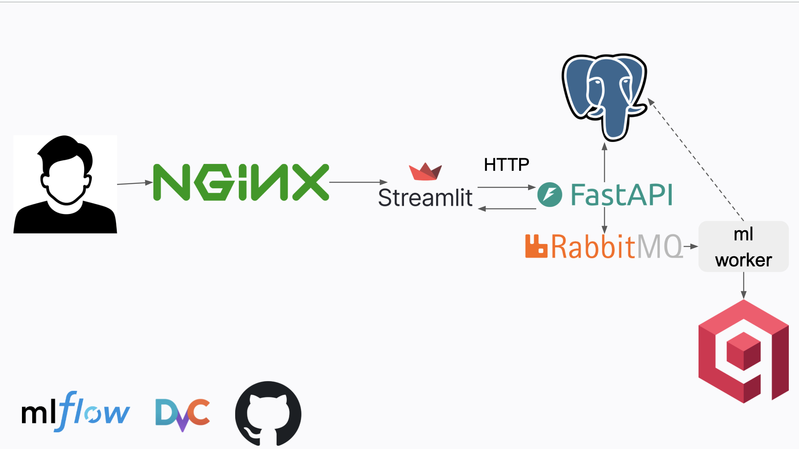

# MRI Tumor Segmentation

## О проекте

Это сервис сегментации опухолей головного мозга на МРТ. Врач грузит исследование, сервис считает маску опухоли, накладывает ее на снимок и подбирает похожие исторические случаи из базы. Цель — дать врачу быстрый взгляд на опухоль и сразу поднять рядом похожие уже размеченные случаи с их анамнезом и исходом.

## Демо

<video src="docs/demo/demo.mp4" controls width="720"></video>

## Задача

При планировании лечения глиом низкой степени злокачественности врач-рентгенолог вручную покадрово обводит контур опухоли на десятках 2D-срезов МРТ. Это занимает от 15 минут на пациента, монотонно и подвержено человеческому фактору. Вторая, независимая задача — предварительное заключение: по снимку видно, что образование есть, но его гистологический тип и степень подтверждает только биопсия, а решения о маршруте пациента принимаются раньше.

Проект решает две задачи:

1. **Сегментация** — автоматически строить бинарную маску опухоли на 2D-срезе МРТ, чтобы врачу оставалось только провалидировать контур, а не рисовать его с нуля.
2. **Поиск похожих случаев** — по загруженному исследованию находить визуально близкие случаи из архива клиники, у которых уже известны гистологический тип, степень, локализация и исход. Это опора для предварительной гипотезы до гистологии, а не замена ей.

Целевые метрики: Dice > 0.80 на кросс-валидации по пациентам и задержка инференса < 5 секунд на срез. Продукт задуман как локальный B2B-ассистент врача, то  есть данные не покидают контур клиники, а не как замена специалиста — финальное решение остается за врачом.

## Данные

Источник — открытый датасет [Brain MRI segmentation](https://www.kaggle.com/datasets/mateuszbuda/lgg-mri-segmentation) с Kaggle (LGG, глиомы низкой степени злокачественности). Скачивается скриптом `scripts/download_dataset.py`.

- **110 пациентов**, суммарно **3929** 2D-срезов МРТ и **3929** масок — разметка полная, битых снимков не найдено.
- Все изображения уже приведены к единому размеру **256×256** - предобработка авторов датасета.
- Срезов на пациента: у большинства 20–40.

Что увидели при EDA и как это повлияло на пайплайн:

- **Сильный дисбаланс классов.** ~65% срезов не содержат опухоли (чистый фон), а на позитивных срезах опухоль занимает всего 0.5–3% площади кадра. Поэтому accuracy нерепрезентативна (предсказание «все черное» дало бы 65%+), и основной метрикой выбран **Dice Coefficient**, а функцией потерь — **Dice Loss**.
- **Разброс яркости между томографами.** Кривые плотности яркости пикселей у разных снимков не совпадают, возможно данные собирались с разного оборудования. Поэтому сырые снимки подавать нельзя — нужна нормализация интенсивностей.

Разбиение train/valid проводится по пациентам (срезы одного пациента не попадают одновременно в обе выборки), чтобы исключить утечку. В индекс похожих случаев Qdrant попадают только train-пациенты.

Подробный EDA и визуализации — в ноутбуке `EDA&compare_models.ipynb`.

## Метрики

Сравнение архитектур — 3-fold кросс-валидация строго по пациентам (срезы одного пациента не пересекаются между train и valid):

| Модель | Dice (mean ± std) | Пороги по фолдам |
| --- | --- | --- |
| UNet с нуля | 0.791 ± 0.042 | 0.6 / 0.8 / 0.8 |
| UNet++ + EfficientNet-b3 | 0.788 ± 0.050 | 0.8 / 0.8 / 0.8 |
| **UNet + SegFormer mit_b2 (в проде)** | **0.811 ± 0.034** | 0.8 / 0.7 / 0.75 |

Преимущество финальной модели статистически значимо (тест Уилкоксона: p = 0.019 и p = 0.00007 против двух альтернатив).

| Метрика | Факт | Цель |
| --- | --- | --- |
| Dice (CV по пациентам) | **0.811** | ≥ 0.80 |
| Задержка инференса | **0.55 с/срез** на CPU | < 5 с |
| Поиск похожих случаев, Precision@3 | **0.49** при prevalence 0.40 (lift +0.09, p = 0.0004) | - |

## Архитектура

Бэкенд на FastAPI, интерфейс на Streamlit. Задача уходит в очередь RabbitMQ, ее подхватывает ML-воркер, который гоняет снимки через UNet с энкодером SegFormer mit_b2. Пользователи и задачи лежат в PostgreSQL, похожие случаи ищутся по векторам в Qdrant.



Основные папки:

- `app` — FastAPI с роутами, моделями, auth, preprocessing и инференсом;
- `ml_worker` — потребитель очереди;
- `webview` — Streamlit-интерфейс;
- `scripts/download_dataset.py` — скачивание датасета с Kaggle;
- `scripts/ingest_similar_cases.py` — индексация train-пациентов в Qdrant;
- `kaggle_3m` — датасет (не в git, качается скриптом);
- `app/weights` — веса модели (DVC + Yandex Object Storage);
- `.github/workflows/ci.yml` — CI на pytest;
- MLflow Tracking — сервис в Docker Compose (порт 5001).

## Быстрый старт

Нужны:

- [uv](https://docs.astral.sh/uv/): `brew install uv`;
- DVC ставится вместе с ML-зависимостями: `uv sync --group ml`.

```bash
git clone git@github.com:akslv03/MFDP.git && cd MFDP
uv sync --all-groups && source .venv/bin/activate
python scripts/download_dataset.py
uv run --group ml dvc pull
cp .env.example .env && cp app/.env.example app/.env
docker compose up --build -d
python scripts/ingest_similar_cases.py
```

После старта UI доступен на [http://localhost:8501](http://localhost:8501), API и документация — на
[http://localhost:8080/api/docs](http://localhost:8080/api/docs). Демо-аккаунт задаётся в `app/.env` (`DEMO_EMAIL` / `DEMO_PASSWORD`, по умолчанию в примере — `demo@client.com` / `demo_password`).
MLflow UI — [http://localhost:5001](http://localhost:5001).

## Docker

`docker compose up -d --build` поднимает API, Streamlit, nginx, RabbitMQ, PostgreSQL, Qdrant и MLflow. Масштабировать воркеры можно прямо на старте:

```bash
docker compose up -d --build --scale ml_worker=3
```

Похожие случаи при первом старте не найдутся, потому что коллекция Qdrant пустая. Индексация запускается отдельным скриптом вручную, после того как Qdrant поднят:

```bash
python scripts/ingest_similar_cases.py
```

Индексируются только train-пациенты, валидационные в индекс не попадают.

## Переменные окружения

Все переменные описаны в `.env.example` и `app/.env.example`. Кратко:

- `DB_*` — подключение к PostgreSQL;
- `SECRET_KEY` — секрет для подписи JWT (обязательно смените в проде);
- `ADMIN_*` / `DEMO_*` — seed-пользователи при первом старте API;
- `COOKIE_NAME` — имя cookie с токеном;
- `RABBITMQ_*` — подключение к очереди и имя очереди;
- `QDRANT_URL` и `QDRANT_COLLECTION` — адрес векторной базы и имя коллекции;
- `KAGGLE_3M_PATH` — путь к датасету;
- `UPLOAD_DIR` и `MAX_UPLOAD_BYTES` — папка для загрузок и лимит размера файла;
- `STREAMLIT_PUBLIC_URL` — публичный адрес UI, куда редиректит корневой маршрут;
- `MLFLOW_TRACKING_URI` — адрес MLflow Tracking (по умолчанию `http://localhost:5001`);
- `AWS_ACCESS_KEY_ID` / `AWS_SECRET_ACCESS_KEY` — статический ключ к Yandex Object Storage для `dvc pull` / `dvc push`.

## MLOps

| Инструмент | Зачем |
| --- | --- |
| **GitHub Actions** | CI: `uv sync --group dev` + `pytest` на push/PR |
| **Docker Compose** | Локальный контур сервиса одной командой |
| **DVC + Yandex Object Storage** | Версионирование весов `app/weights/*.pt` в S3-совместимом remote |
| **MLflow** | Трекинг экспериментов сравнения моделей (CV Dice) |
| **pytest** | Регрессии API, preprocessing, сплитов, постобработки |

### DVC remote (Yandex Object Storage)

В git лежит только указатель `.dvc` и конфиг. Сами веса — в бакете Object Storage.


### MLflow

```bash
docker compose up -d mlflow
MLFLOW_TRACKING_URI=http://localhost:5001 uv run --group ml python scripts/log_cv_metrics_mlflow.py
```

Откройте [http://localhost:5001](http://localhost:5001) → experiment `mri-segmentation-cv`.

## Методы

**Препроцессинг.** Исходные срезы 256×256 приводятся к виду, на котором учится модель: обрезка черного фона вокруг мозга → паддинг до квадрата → ресайз до 160×160 → нормализация интенсивностей перцентилями 10/99 и min-max в диапазон 0–1 → перевод в RGB. Обрезка фона и нормализация напрямую вытекают из EDA: дисбаланс площади и разброс яркости между томографами.

**Сегментация.** Задача решается в 2D. Обучение шло от простого к сложному: базовый UNet «с нуля» как референс, затем UNet++ с энкодером EfficientNet-b3 и, наконец, UNet с трансформерным энкодером SegFormer mit_b2. Для каждого предобученного энкодера сравнивались два режима — заморозка энкодера и fine-tune всей сети. Функция потерь — Dice Loss, устойчива к дисбалансу классов. Финальная архитектура — **UNet + SegFormer mit_b2 с fine-tune всей сети**. Поверх неё подобран порог бинаризации на train каждого фолда и добавлена морфологическая постобработка маски.

**Продакшен-веса.** В `app/weights/unet_transformer_finetuned_best.pt` лежит чекпоинт fold0, а не ансамбль трёх фолдов: для сервиса нужен один файл, CV-метрики считаются по всем трём fold-моделям отдельно. В production `MASK_THRESHOLD = 0.75` — среднее порогов фолдов `[0.8, 0.7, 0.75]`.

**Поиск похожих случаев.** Эмбеддинг пациента — взвешенное по площади опухоли среднее эмбеддингов его срезов, так вектор описывает зону поражения, а не фон. Поиск идет по cosine-близости в Qdrant с мягким rerank по возрасту и полу.

Все эксперименты, сравнение моделей и валидация — в ноутбуке `EDA&compare_models.ipynb`.

## Метрики

Метрики из output `EDA&compare_models.ipynb` (3-fold CV по пациентам, seed 42, одинаковые фолды и препроцессинг, порог только на train). Основная метрика — Dice Coefficient: опухоль занимает малую долю кадра, accuracy тут нерепрезентативна.

| Модель | Dice volume (mean ± std) | Пороги по фолдам |
| --- | --- | --- |
| **UNet + SegFormer mit_b2 (финал)** | **0.811 ± 0.034** | 0.8, 0.7, 0.75 |
| UNet с нуля | 0.791 ± 0.042 | 0.6, 0.8, 0.8 |
| UNet++ + EfficientNet-b3 | 0.788 ± 0.050 | 0.8, 0.8, 0.8 |

Задержка инференса (CPU ноутбука, 4 потока, без GPU):

| Объём | Время | На срез |
| --- | --- | --- |
| 1 срез (cold) | 2.3 с | 2.3 с |
| 22 среза (типичное исследование) | 12.0 с | **0.55 с** |
| 40 срезов | 19.7 с | 0.49 с |

Качество поиска похожих случаев (leave-one-patient-out, эмбеддинги out-of-fold, цель — молекулярный подтип CNCluster):

| Метод | P@3 |
| --- | --- |
| Векторный поиск (наш) | **0.491** |
| ImageNet ResNet18 | 0.498 |
| Простая морфометрия | 0.483 |
| Случайный порядок | 0.400 |

Значимо лучше случайного (p = 0.002); на 110 пациентах не лучше дешёвых baseline.

На выходе сервис отдает бинарную маску и наложение на снимок МРТ (PNG). Инференс, как и обучение, идет на разрешении 160×160 (см. раздел «Методы»).

## Тесты

Локально и в GitHub Actions:

```bash
uv sync --group dev
uv run pytest
```

Тестами покрыто то, что критично для работы: авторизация, создание задач, загрузка ZIP, чтение и сортировка срезов, preprocessing, постобработка маски, сплит train/valid, разрешение весов модели, поиск похожих случаев.